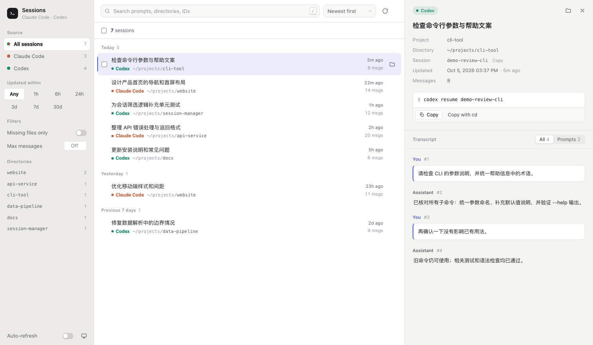

# 会话管理器（Session Manager）

一个本地会话管理工具，用于在浏览器或终端查看、筛选及恢复 Claude Code 和 Codex CLI 会话。

## 界面预览

下图使用模拟会话数据，仅展示界面效果，不包含真实会话内容。



## 使用方法

使用 Python 3 运行，无须安装第三方依赖：

```sh
python3 session_manager.py                 # 启动本地网页（默认 127.0.0.1:8765）
python3 session_manager.py list            # 在终端列出会话
python3 session_manager.py pick            # 交互式选择并恢复会话
python3 session_manager.py resume <会话ID> # 直接恢复指定会话
```

运行时会读取本机 `~/.claude/projects/` 和 `~/.codex/sessions/` 中的会话数据；请勿将会话数据或本机配置加入版本库。
